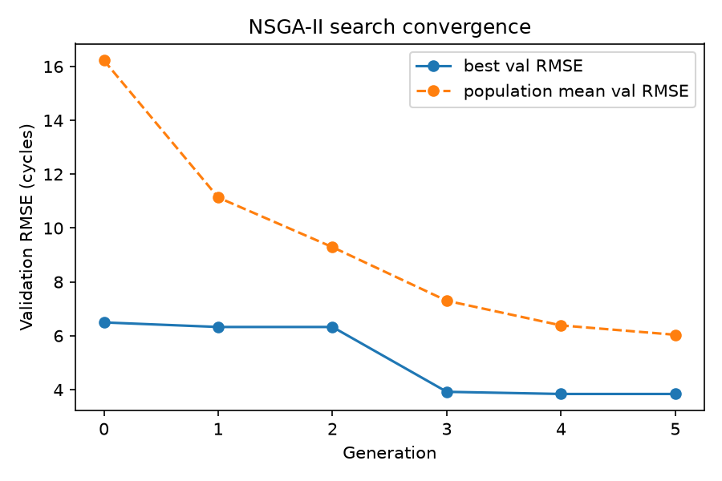
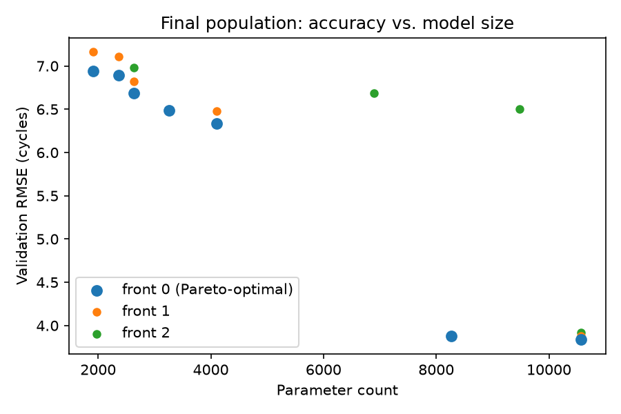
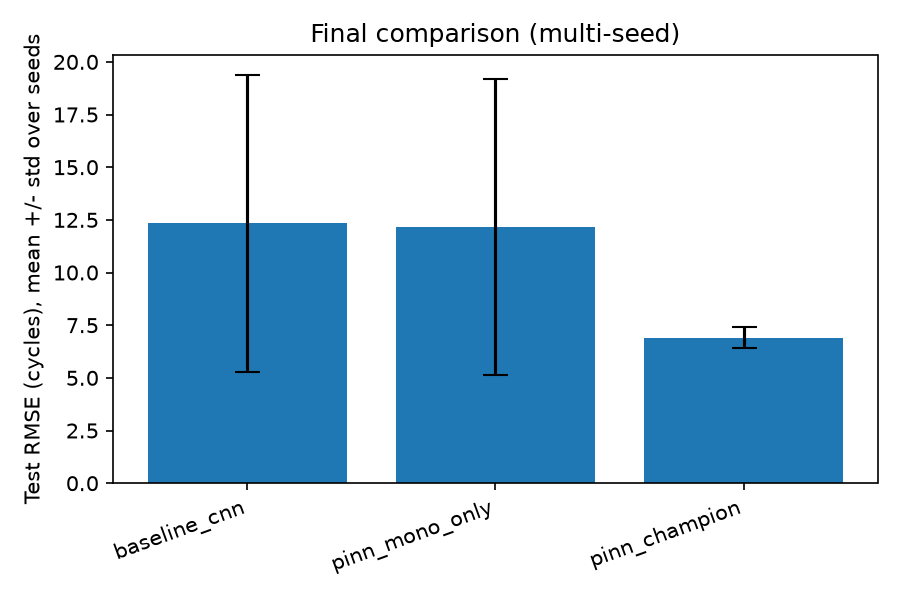
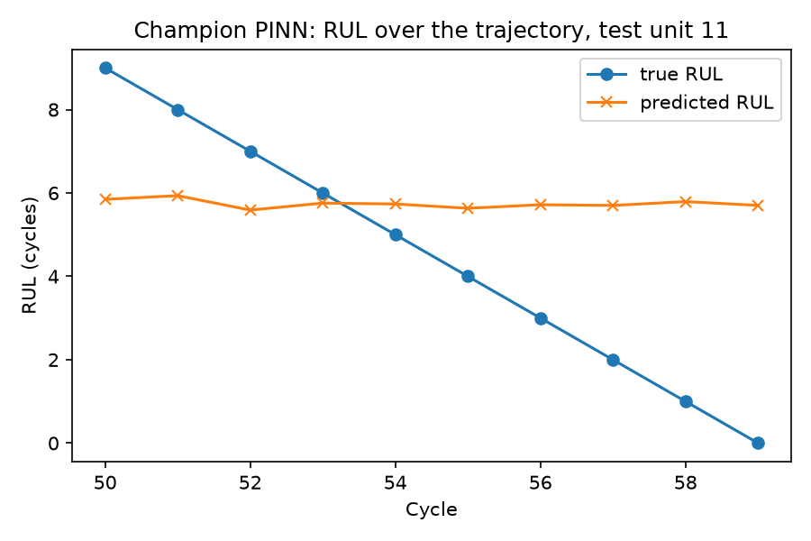

# Remaining Useful Life Prediction with PINN and Neuroevolution

Predicting the Remaining Useful Life (RUL) of turbofan engines on NASA's
[N-CMAPSS](https://www.nasa.gov/intelligent-systems-division/discovery-and-systems-health/pcoe/pcoe-data-set-repository/)
dataset with a Physics-Informed Neural Network (PINN), whose architecture and
hyperparameters are tuned by a neuroevolutionary (NSGA-II) search.

## Approach

- **Dataset:** N-CMAPSS DS02 (turbofan run-to-failure trajectories under
  realistic flight conditions). Each flight cycle's ~11,500 raw 1 Hz samples
  are averaged to one row per cycle before windowing (see
  [`rul/data/windowing.py`](src/rul/data/windowing.py)) — RUL is a per-cycle
  quantity, not a per-second one.
- **Models:** standard sequence baselines (MLP / 1D-CNN / LSTM-GRU) trained
  with plain regression loss, compared against a PINN that adds soft
  physics-informed penalties (monotonic degradation, health-parameter
  consistency).
- **Neuroevolution:** an NSGA-II search over encoder type, width, window
  length, learning rate, and the two physics-loss weights, optimizing
  validation RMSE and parameter count jointly (a Pareto front, not a single
  score).
- **Evaluation:** RMSE and the NASA asymmetric score on held-out engine
  units (split at the unit level to avoid data leakage), reported as mean
  ± std over multiple seeds — since `seed` also determines which dev unit
  is held out for validation, this is closer to k-fold cross-validation
  than to bare weight-init variance.

## Results

### Baselines (Phase 3) and PINN physics-loss ablation (Phase 4)

Single-seed, 5 train / 1 val / 3 test units:

| Model | Val RMSE | Test RMSE | Test NASA score |
|---|---|---|---|
| MLP baseline | 5.59 | 10.05 | 1.07 |
| LSTM baseline | 4.08 | 8.49 | 0.87 |
| CNN baseline | 3.92 | 6.67 | 0.70 |
| PINN, no physics | 3.92 | 6.68 | 0.70 |
| PINN, monotonic loss only | 3.92 | 6.68 | 0.70 |
| PINN, health loss only (λ=0.02) | 6.26 | 10.30 | 1.13 |
| PINN, both physics terms | 6.26 | 10.31 | 1.13 |

The monotonic-degradation term is essentially inert here (verified directly,
not just inferred: its magnitude stays under 0.01 through training) — the
CNN encoder's predictions are already near-monotonic because the input
sensors themselves drift consistently with cycle number. The
health-consistency term *hurts*, even after fixing a real bug (7 of 10
N-CMAPSS health parameters are exactly constant in DS02, which blew up an
unstandardized loss to ~10¹⁴× the RUL MSE) and rebalancing its weight by a
measured 47× — a small-data multi-task tradeoff, not a code defect. Full
writeup: [Phase 4 commit](https://github.com/GMCavalheri/Remaining-Useful-Life-RUL-Prediction-with-PINN-and-Neuroevolution/commit/bc30e83).

### Neuroevolution (Phase 5)

Population 16, 6 generations, 20-epoch fitness budget:




The search converged on a CNN encoder (kernel size 7), `λ_mono=0.71`,
`λ_health=0.00075` — independently rediscovering, via search rather than
manual ablation, the same conclusion Phase 4 reached by hand (CNN
architecture, near-zero health weight).

### Final multi-seed comparison (Phase 6)

The headline result — and a lesson in itself. A single-seed comparison made
the evolved champion look *worse* than the plain CNN baseline on test RMSE.
That conclusion was itself drawn from n=1; testing it properly over 5 seeds
(which vary the held-out validation unit) reversed it:



| Config | Test RMSE (mean ± std, 5 seeds) | Test NASA score |
|---|---|---|
| CNN baseline | 12.34 ± 7.04 | 5.11 ± 7.18 |
| PINN, monotonic only | 12.17 ± 7.03 | 5.06 ± 7.32 |
| **Evolved champion** | **6.91 ± 0.50** | **0.76 ± 0.17** |

The large baseline std isn't spread evenly — it's one catastrophic split:
when unit 10 lands in validation, the plain CNN's test RMSE spikes to 25.5
(vs. 6.6–8.9 on every other split). The evolved champion, on that *same*
split, scores 6.42 — its best of five. The real finding isn't "slightly
more accurate on average," it's that the evolved configuration is
**dramatically more robust to which unit ends up validating it**, never
failing badly, while the hand-picked configs occasionally do.

### A limitation worth stating plainly



The evolved champion's `window_length=50` won on accuracy, but it means the
model needs 50 cycles of history before it can predict *anything* — for
test unit 11 (which fails at cycle 59), that leaves only cycles 50–59
covered at all. Zooming into that window, predictions are also nearly flat
(~5.7–5.9) while true RUL declines linearly from 9 to 0: decent aggregate
RMSE, but the model doesn't track the accelerating end-of-life decline
well. A longer window traded early-life applicability and end-of-life
sensitivity for aggregate accuracy — the current 2-objective search (RMSE,
parameter count) has no way to penalize that. A natural extension: add
"minimum cycles before first prediction" as a third NSGA-III objective.

## Repository layout

```
src/rul/
  data/       # N-CMAPSS loading, per-cycle aggregation, windowing, unit-wise splitting, scaling
  models/     # encoders (MLP/CNN/LSTM/GRU), baseline head, PINN (RUL head + health head)
  physics/    # monotonic-degradation and health-consistency loss terms
  training/   # training loop (early stopping), RMSE + NASA score metrics
  evolution/  # genome, NSGA-II (non-dominated sorting + crowding distance), fitness, search loop
  baselines/  # non-physics-informed reference models
scripts/      # download_data / train / train_pinn / evolve / final_experiments / make_report
configs/      # YAML experiment configs (inherit from configs/base.yaml)
tests/        # unit tests (synthetic HDF5 fixture; no dependency on the real dataset)
assets/       # committed report figures (regenerate with scripts/make_report.py)
```

## Setup

```bash
uv sync --extra dev --extra evolution
uv run python scripts/download_data.py --subset DS02
```

## Running tests

```bash
make test
```

## Reproducing the results

```bash
# Baselines (Phase 3)
uv run python scripts/train.py --config configs/baseline_cnn.yaml

# PINN + physics-loss ablation (Phase 4)
uv run python scripts/train_pinn.py --config configs/pinn_full.yaml

# Neuroevolution search (Phase 5) -- resumes automatically if interrupted
uv run python scripts/evolve.py --config configs/evolve.yaml

# Multi-seed final comparison (Phase 6)
uv run python scripts/final_experiments.py \
    --configs configs/baseline_cnn.yaml configs/pinn_mono_only.yaml configs/pinn_champion.yaml \
    --seeds 0 1 2 3 4

# Regenerate assets/*.png from the results above (Phase 7)
uv run python scripts/make_report.py
```

## Known limitations

- Single dataset subset (DS02) and a small unit count (6 dev / 3 test) —
  results, especially the neuroevolution comparison, should be treated as a
  methodology demonstration, not a definitive benchmark. Extending to other
  N-CMAPSS subsets (DS01–DS08) is natural future work.
- The neuroevolution search optimizes (validation RMSE, parameter count)
  only — see "a limitation worth stating plainly" above for what that
  misses.
- The health-consistency physics loss did not help on this dataset; the
  monotonic loss was largely inactive because the baseline already
  satisfies it. Neither finding should be read as "physics-informed losses
  don't work" — both are specific to DS02's near-monotonic sensor drift and
  its many structurally-constant health parameters.
